<!-- The visuals in this profile are generated. Edit scripts/content.py, then run `python scripts/build.py`. -->

  <picture>
    <source media="(prefers-color-scheme: dark)" srcset="assets/hero-dark.svg">
    <source media="(prefers-color-scheme: light)" srcset="assets/hero-light.svg">
    
  </picture>

  <a href="https://www.linkedin.com/in/ahmed-rebai-18506938a/"><picture>
    <source media="(prefers-color-scheme: dark)" srcset="assets/btn-linkedin-dark.svg">
    <source media="(prefers-color-scheme: light)" srcset="assets/btn-linkedin-light.svg">
    
  </picture></a>&nbsp;&nbsp;<a href="mailto:rebaiahmed244@gmail.com"><picture>
    <source media="(prefers-color-scheme: dark)" srcset="assets/btn-email-dark.svg">
    <source media="(prefers-color-scheme: light)" srcset="assets/btn-email-light.svg">
    
  </picture></a>

  I'm a software engineer and second-year <b>Data Engineering</b> student at the Faculty of Sciences of Sfax,
  working across <b>cloud, DevOps and AI/data</b>. I build systems the way good pipelines are built:
  <b>every output traceable, every change tested, every deploy automated.</b> In 2026 I shipped RAG, multi-agent
  and edge-AI systems across three internships and earned three Microsoft data certifications.
  <b>Open to work</b>, so let's talk.

  <picture>
    <source media="(prefers-color-scheme: dark)" srcset="assets/tiles-dark.svg">
    <source media="(prefers-color-scheme: light)" srcset="assets/tiles-light.svg">
    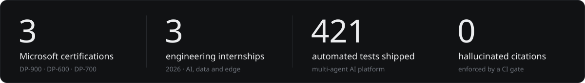
  </picture>

 

  <picture>
    <source media="(prefers-color-scheme: dark)" srcset="assets/h-experience-dark.svg">
    <source media="(prefers-color-scheme: light)" srcset="assets/h-experience-light.svg">
    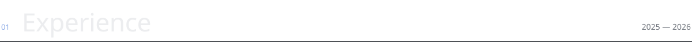
  </picture>

  <picture>
    <source media="(prefers-color-scheme: dark)" srcset="assets/experience-dark.svg">
    <source media="(prefers-color-scheme: light)" srcset="assets/experience-light.svg">
    
  </picture>

 

  <picture>
    <source media="(prefers-color-scheme: dark)" srcset="assets/h-work-dark.svg">
    <source media="(prefers-color-scheme: light)" srcset="assets/h-work-light.svg">
    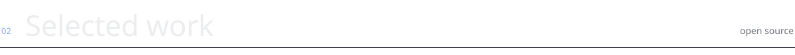
  </picture>

  <a href="https://github.com/Ahmed1-Rebai/Postmortem-Autopilot"><picture>
    <source media="(prefers-color-scheme: dark)" srcset="assets/postmortem-dark.svg">
    <source media="(prefers-color-scheme: light)" srcset="assets/postmortem-light.svg">
    
  </picture></a>

  <a href="https://github.com/Ahmed1-Rebai/tradepulse"><picture>
    <source media="(prefers-color-scheme: dark)" srcset="assets/tradepulse-dark.svg">
    <source media="(prefers-color-scheme: light)" srcset="assets/tradepulse-light.svg">
    
  </picture></a>

  <a href="https://github.com/Ahmed1-Rebai/Konsol"><picture>
    <source media="(prefers-color-scheme: dark)" srcset="assets/card-konsol-dark.svg">
    <source media="(prefers-color-scheme: light)" srcset="assets/card-konsol-light.svg">
    
  </picture></a>
  <a href="https://github.com/Ahmed1-Rebai/Tunisian_Footbal_DataWarehouse"><picture>
    <source media="(prefers-color-scheme: dark)" srcset="assets/card-football-dark.svg">
    <source media="(prefers-color-scheme: light)" srcset="assets/card-football-light.svg">
    
  </picture></a>

  <a href="https://github.com/Ahmed1-Rebai/Champions_League"><picture>
    <source media="(prefers-color-scheme: dark)" srcset="assets/mini-champions_league-dark.svg">
    <source media="(prefers-color-scheme: light)" srcset="assets/mini-champions_league-light.svg">
    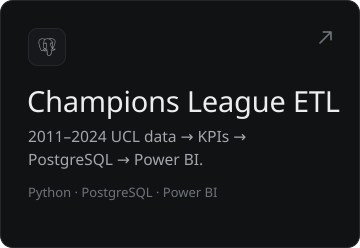
  </picture></a>
  <a href="https://github.com/Ahmed1-Rebai/RealTime-Fitness-Analyzer"><picture>
    <source media="(prefers-color-scheme: dark)" srcset="assets/mini-realtime-fitness-analyzer-dark.svg">
    <source media="(prefers-color-scheme: light)" srcset="assets/mini-realtime-fitness-analyzer-light.svg">
    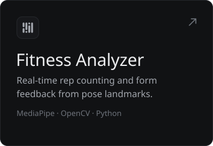
  </picture></a>
  <a href="https://github.com/Ahmed1-Rebai/Opti-DataCenter-Tunisie"><picture>
    <source media="(prefers-color-scheme: dark)" srcset="assets/mini-opti-datacenter-tunisie-dark.svg">
    <source media="(prefers-color-scheme: light)" srcset="assets/mini-opti-datacenter-tunisie-light.svg">
    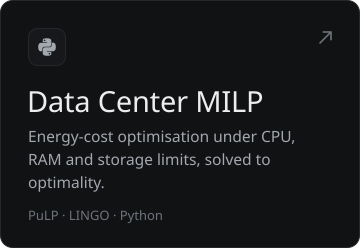
  </picture></a>
  <a href="https://github.com/Ahmed1-Rebai/swag-labs-mobile-tests"><picture>
    <source media="(prefers-color-scheme: dark)" srcset="assets/mini-swag-labs-mobile-tests-dark.svg">
    <source media="(prefers-color-scheme: light)" srcset="assets/mini-swag-labs-mobile-tests-light.svg">
    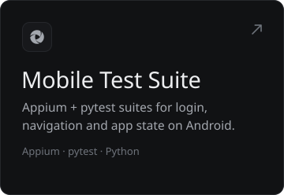
  </picture></a>
  <a href="https://github.com/Ahmed1-Rebai/NovaWrite"><picture>
    <source media="(prefers-color-scheme: dark)" srcset="assets/mini-novawrite-dark.svg">
    <source media="(prefers-color-scheme: light)" srcset="assets/mini-novawrite-light.svg">
    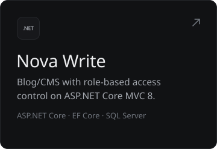
  </picture></a>
  <a href="https://github.com/Ahmed1-Rebai/Super_Keyboard"><picture>
    <source media="(prefers-color-scheme: dark)" srcset="assets/mini-super_keyboard-dark.svg">
    <source media="(prefers-color-scheme: light)" srcset="assets/mini-super_keyboard-light.svg">
    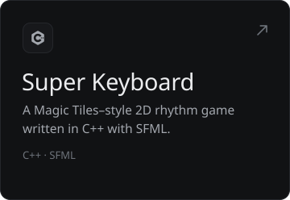
  </picture></a>

 

  <picture>
    <source media="(prefers-color-scheme: dark)" srcset="assets/h-certs-dark.svg">
    <source media="(prefers-color-scheme: light)" srcset="assets/h-certs-light.svg">
    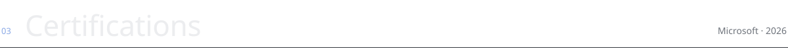
  </picture>

  <a href="https://learn.microsoft.com/en-us/credentials/certifications/fabric-data-engineer-associate/"><picture>
    <source media="(prefers-color-scheme: dark)" srcset="assets/cert-dp-700-dark.svg">
    <source media="(prefers-color-scheme: light)" srcset="assets/cert-dp-700-light.svg">
    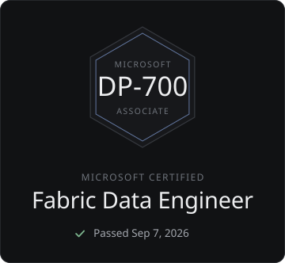
  </picture></a>
  <a href="https://learn.microsoft.com/en-us/credentials/certifications/fabric-analytics-engineer-associate/"><picture>
    <source media="(prefers-color-scheme: dark)" srcset="assets/cert-dp-600-dark.svg">
    <source media="(prefers-color-scheme: light)" srcset="assets/cert-dp-600-light.svg">
    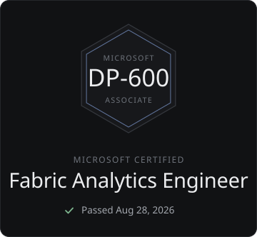
  </picture></a>
  <a href="https://learn.microsoft.com/en-us/credentials/certifications/azure-data-fundamentals/"><picture>
    <source media="(prefers-color-scheme: dark)" srcset="assets/cert-dp-900-dark.svg">
    <source media="(prefers-color-scheme: light)" srcset="assets/cert-dp-900-light.svg">
    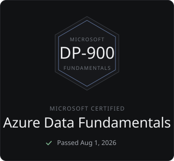
  </picture></a>

 

  <picture>
    <source media="(prefers-color-scheme: dark)" srcset="assets/h-stack-dark.svg">
    <source media="(prefers-color-scheme: light)" srcset="assets/h-stack-light.svg">
    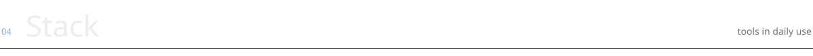
  </picture>

  <picture>
    <source media="(prefers-color-scheme: dark)" srcset="assets/stack-dark.svg">
    <source media="(prefers-color-scheme: light)" srcset="assets/stack-light.svg">
    
  </picture>

 

  <picture>
    <source media="(prefers-color-scheme: dark)" srcset="assets/h-activity-dark.svg">
    <source media="(prefers-color-scheme: light)" srcset="assets/h-activity-light.svg">
    
  </picture>

  <picture>
    <source media="(prefers-color-scheme: dark)" srcset="assets/activity-dark.svg">
    <source media="(prefers-color-scheme: light)" srcset="assets/activity-light.svg">
    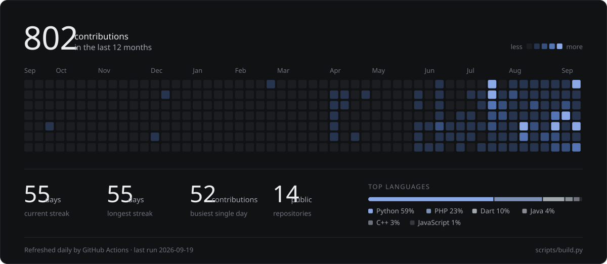
  </picture>

 

  <picture>
    <source media="(prefers-color-scheme: dark)" srcset="assets/footer-dark.svg">
    <source media="(prefers-color-scheme: light)" srcset="assets/footer-light.svg">
    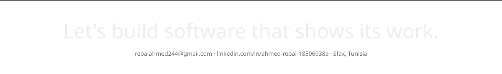
  </picture>

